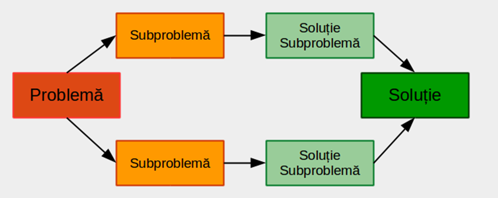

---

## Ce este Divide et Impera? 🤔

Toti am auzit de acest concept la scoala insa poate a sunat ciudat.
Sa luam exemplul cucerii unei imparatii.

## Cucerirea unei imparatii

Când vine vorba de cucerire, acest principiu este aplicat în diverse moduri:

1. **Divizarea populațiilor locale:** Cuceritorii pot încerca să divizeze grupurile și triburile locale prin intermediul alianțelor sau creând conflicte interne. Indivizii sau grupurile divizate devin mai vulnerabile în fața puterii cuceritorului.

2. **Provocarea tensiunilor interne:** Cuceritorii pot încuraja conflictele dintre diferitele grupuri etnice, religioase sau sociale din regiunea pe care încearcă să o cucerească. Prin exacerbarea tensiunilor existente, ei pot slăbi coeziunea locală și facilita intrarea lor în regiune.


3. **Controlul informațiilor și comunicării:** Cenzurarea sau controlul informațiilor poate duce la izolarea diferitelor grupuri sau regiuni, împiedicându-le să colaboreze eficient împotriva cuceritorului. În plus, manipularea informațiilor poate fi folosită pentru a întări diviziunile deja existente.

4. **Utilizarea alianțelor temporare:** Cuceritorii pot forma alianțe temporare cu unele grupuri împotriva altora, pentru a-și consolida propria poziție și pentru a slăbi inamicul în mod strategic.

---

## În informatică

În informatică, conceptul de "Divide et Impera" este foarte relevant și este aplicat în diverse contexte și algoritmi pentru a rezolva probleme complexe. Acest principiu este adesea implementat în **algoritmi de tip divide et impera**, care împart o problemă mare în subprobleme mai mici, mai ușor de rezolvat, și apoi combină soluțiile acestor subprobleme pentru a obține rezultatul final. Aceasta este o strategie eficientă pentru a gestiona eficient problemele complexe.

### Divizarea problemelor:

În informatică, algoritmii bazati pe principiul "divide et impera" încep prin împărțirea problemei mari în subprobleme mai mici și mai simple. De exemplu, **algoritmul Merge Sort** împarte lista de elemente de sortat în două părți egale și apoi sortează separat fiecare parte înainte de a le combina într-o listă sortată.

### Rezolvarea subproblemelor:

Fiecare subproblemă rezultată în urma divizării este rezolvată separat, adesea recursiv. În **algoritmul Quick Sort**, subliste mai mici sunt sortate recursiv până când întreaga listă este sortată.

### Combinarea soluțiilor:

După ce toate subproblemele sunt rezolvate, soluțiile lor sunt combinate pentru a obține soluția finală a problemei. De exemplu, în **algoritmul Merge Sort**, subliste sortate sunt combinate într-o singură listă sortată.

### Eficiență și performanță:

Această abordare poate aduce beneficii considerabile în ceea ce privește eficiența și performanța. Divizarea problemei în subprobleme mai mici poate reduce complexitatea algoritmului, ceea ce poate duce la timpuri de execuție mai scurte sau la utilizarea mai eficientă a resurselor.

Această strategie este aplicată în **algoritmi precum Merge Sort, Quick Sort**, algoritmi de căutare binară sau în rezolvarea problemelor complexe de tip divide și conquistă, cum ar fi **algoritmul lui Strassen** pentru înmulțirea matricelor sau în algoritmul de căutare într-un arbore binar.

Subproblemele trebuie să fie de același tip cu problema inițială, ele urmând a fi rezolvate prin aceeași tehnică.

Subproblemele în care se descompun problema dată trebuie să fie:

- de același tip cu problema dată;
- de dimensiuni mai mici (mai “ușoare”);
- independente (să nu se suprapună, prelucrează seturi de date distincte).
  

Divide et Impera admite de regulă o implementare recursivă – rezolvarea problemei constă în rezolvarea unor subprobleme de același tip. Un algoritm pseudocod care descrie metoda este:

```cpp
Algoritm DivImp(P)
    Dacă P este problemă elementară
        R <- RezolvăDirect(P)
    Altfel
        [P1,P2] <- Descompune(P)
        R1 <- DivImp(P1)
        R2 <- DivImp(P2)
        R <- Combină(R1,R2)
    SfârșitDacă
SfârșitAlgoritm
```
